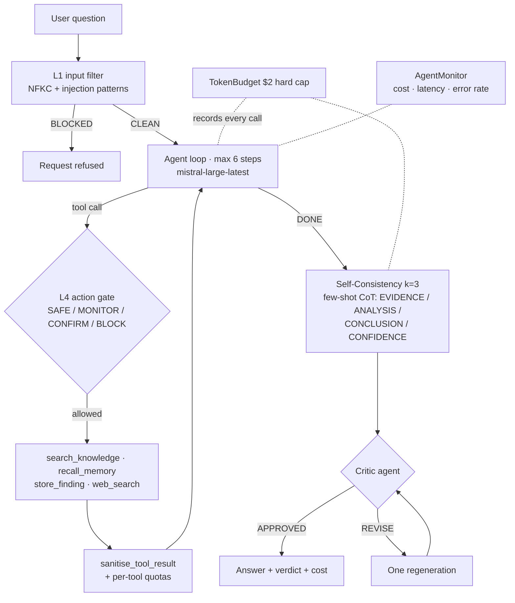

# WattWise ⚡ — renewable-energy research agent (prodagent)

A production-ready research agent over a renewable-energy corpus (solar · wind · hydro):
hybrid RAG (BM25 + Pinecone dense + RRF) + cross-encoder reranking, L1/L4 security
guardrails, token budget, few-shot CoT with Self-Consistency k=3, a critic agent, an
MCP server (stdio + HTTP), LangSmith tracing, a FastAPI backend and a React TS frontend.

**Live:** [prodagent-frontend.onrender.com](https://prodagent-frontend.onrender.com) ·
API + MCP at [prodagent-backend.onrender.com](https://prodagent-backend.onrender.com/health)

> ⚠️ Transparency (EU AI Act, limited risk): every response is produced by an AI system.

## How a question flows



## Repository structure

```
src/        agent, retriever, guardrails, reasoning, critic, monitor, MCP server, eval
tests/      test_security.py (5/5 injection) · test_mcp.py (3/3) · retriever · reasoning
docs/       architecture.md (diagram + PEAS) · ragas_results.json
data/       the 3 corpus documents (solar.md, wind.md, hydro.md)
backend/    FastAPI app: /ask · /health · /metrics · /mcp (streamable HTTP)
frontend/   React TS chat UI (Vite)
```

## Quickstart (from a clean clone)

```bash
python3 -m venv .venv && source .venv/bin/activate
pip install -r requirements.txt -r backend/requirements.txt
cp .env.example .env          # fill MISTRAL_API_KEY (TAVILY_API_KEY optional)

pytest tests/                 # 32 tests, all offline — no key needed
uvicorn backend.main:app --port 8000

cd frontend && npm install && npm run dev   # UI on http://localhost:5173
```

Ask from the terminal without the UI:

```bash
python -c "from dotenv import load_dotenv; load_dotenv(); \
from src.agent import run; print(run('Which renewable source is cheapest?')['answer'])"
```

## MCP server

Three tools with full docstrings and error handling: `search_corpus`,
`store_finding`, `recall_memory`.

**Local (stdio) — any MCP client (Claude Desktop, Cursor, …):**

```json
{
  "mcpServers": {
    "prodagent": {
      "command": "python",
      "args": ["-m", "src.mcp_server"],
      "cwd": "/path/to/prodagent"
    }
  }
}
```

**Remote (streamable HTTP) — the deployed backend serves the same tools at `/mcp`,
protected by `MCP_API_KEY`:**

```
https://prodagent-backend.onrender.com/mcp?key=<MCP_API_KEY>
```

Add that URL as a custom connector in Claude, or in any MCP client:

```json
{
  "mcpServers": {
    "prodagent-remote": {
      "url": "https://prodagent-backend.onrender.com/mcp?key=<MCP_API_KEY>"
    }
  }
}
```

Inspector: `npx @modelcontextprotocol/inspector python -m src.mcp_server`

## Cost

| Item | Price |
|---|---|
| mistral-large-latest | $2.00 / M input tokens · $6.00 / M output tokens |
| Typical run (loop + k=3 synthesis + critic) | ≈ $0.02–0.03 |
| Pinecone (serverless, integrated embeddings) + Tavily + LangSmith | free tiers |
| Hard cap per run (`TokenBudget`) | $2.00 — the run raises and stops at the cap |
| Warning threshold | 25% of the cap, printed after the crossing call |
| Per-tool quotas | search_knowledge ≤ 5 · web_search ≤ 3 per run |

## Deployment (Render)

Deployed as two Render services (created via Render's MCP server): the Python web
service `prodagent-backend` (REST + MCP) and the static site `prodagent-frontend`.
Pushes to `main` auto-deploy. `render.yaml` documents the same setup as a Blueprint
for reproduction; secrets (`MISTRAL_API_KEY`, `TAVILY_API_KEY`, `MCP_API_KEY`,
`PINECONE_API_KEY`, `LANGSMITH_*`) are set as service env vars, never committed.

## Observability

- **LangSmith**: every run traces as `renewable_research_agent` with child spans per
  tool call (`search_knowledge`, `web_search`, …), per reasoning voice (k=3) and the
  critic verdict. Enable with `LANGSMITH_TRACING=true` + key/project env vars.
- **/metrics**: cost per run, per-tool error rate and latency, budget alerts.
- **Versioning**: `/health` returns sha256 hashes of both system prompts — a changed
  hash marks a behaviour change in every log entry.

## CI

GitHub Actions (`.github/workflows/ci.yml`): backend job runs the full offline test
suite (`LLM_PROVIDER=mock`); frontend job type-checks and builds the React app.

## Report

See [REPORT.md](REPORT.md): problem statement, architecture, RAGAS table,
security before/after, EU AI Act tier, limitations, AI use declaration.
